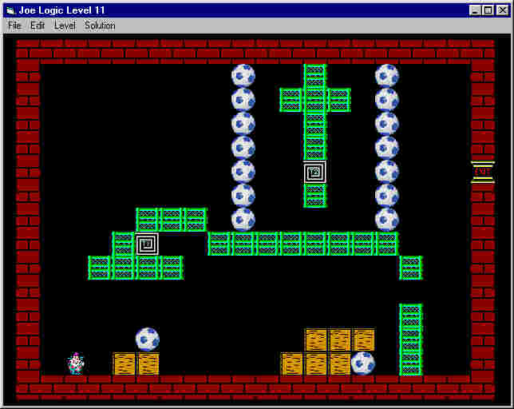



## Joe Logic ,A fully editable, fun and addicting game

### Description

I've always liked logical games, brain teasers, etc.,

One favorite of mine, though, is too slow and lacks

the ability to edit your own levels.

Joe Logic is an emulation of this logical game.

But Joe Logic is much faster and fully editable!

And although the concept is the same, the graphics and the

levels are all original.

This game is really very addicting.

There are 25 levels as of this submission

and more are likely to follow.

If you make your own levels and would like to share them,

please drop me an email. I may add them here.

Also, all solutions are included but I would challenge

you to try to solve them first.
 
### More Info
 

             |
---                |---
**Submitted On**   |2001-02-24 23:30:00
**By**             |[Jose M\. Lopez](https://github.com/Planet-Source-Code/PSCIndex/blob/master/ByAuthor/jose-m-lopez.md)
**Level**          |Intermediate
**User Rating**    |5.0 (90 globes from 18 users)
**Compatibility**  |VB 6\.0
**Category**       |[Games](https://github.com/Planet-Source-Code/PSCIndex/blob/master/ByCategory/games__1-38.md)
**World**          |[Visual Basic](https://github.com/Planet-Source-Code/PSCIndex/blob/master/ByWorld/visual-basic.md)
**Archive File**   |[CODE\_UPLOAD154792252001\.zip](https://github.com/Planet-Source-Code/jose-m-lopez-joe-logic-a-fully-editable-fun-and-addicting-game__1-21329/archive/master.zip)

